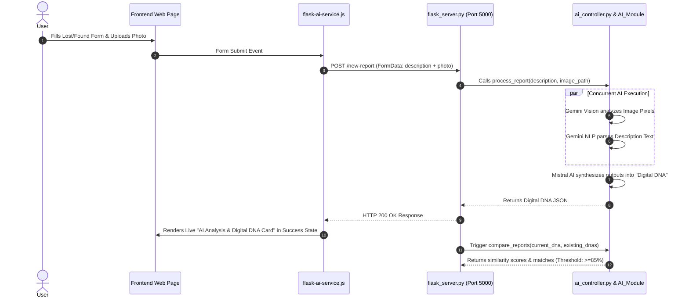

# ⚡ Reunite: AI-Powered Lost & Found Item Matchmaker

**Reunite** is a modern, community-powered Lost & Found web platform integrated with a multimodal **AI Vision & Multimodal Matching Engine**. It automatically processes lost/found item descriptions and photos to extract a standardized **"Digital DNA"** of each item and calculates similarity confidence scores to match lost items with found items.

---

## 🌟 Architecture & Component Overview

The repository is organized into three decoupled layers:

```
c:\xampp\htdocs\Reunite\
├── Frontend/                 # PHP / JS / CSS Web Application (Served via XAMPP/Apache)
│   ├── js/
│   │   ├── flask-ai-service.js # Dedicated JS Service for Flask REST API communication
│   │   ├── report-lost-item.js  # Lost item form handler & AI DNA UI renderer
│   │   ├── report-found-item.js # Found item form handler
│   │   └── ...
│   ├── css/                  # Custom styling & glassmorphism UI components
│   └── report-lost-item.php  # User submission interfaces
├── AI_Module/                # Core AI Engine (Analyzers, Prompts, Config, Utilities)
│   ├── analyzers/            # Gemini Vision & Text feature extractors
│   ├── compare/              # Gemini similarity & DNA match evaluation
│   ├── prompts/              # System prompts for Gemini & Mistral LLMs
│   ├── config.py             # Client setup & environment variables loader
│   └── .env                  # API keys storage (Gemini & Mistral)
├── ai_controller.py          # Master AI Controller & Parallel Pipeline Executor
├── flask_server.py           # Master Flask REST API Middleware (Port 5000)
├── matches.py                # Bridge between Flask and AI similarity comparison
├── requirements.txt          # Unified Python dependencies
└── test.http                 # Master API HTTP test suite
```

---

## 🔍 How Each Component Works

### 1. 🌐 Frontend Layer (`Frontend/`)
* **Technology**: PHP, HTML5, Vanilla CSS, JavaScript (ES6+).
* **Role**: Provides interactive user interfaces for registering, logging in, reporting lost items, and reporting found items.
* **JS Service Bridge (`Frontend/js/flask-ai-service.js`)**:
  * Acts as a dedicated service layer connecting the web browser directly to the Flask backend.
  * Sends `FormData` requests (`description` + `image` file) via `fetch` to `http://127.0.0.1:5000/new-report`.
  * Contains `renderAiDnaCard()` to dynamically render the extracted AI Digital DNA card into the UI upon successful analysis.

---

### 2. 🔌 Middleware REST API (`flask_server.py`)
* **Technology**: Python, Flask, Flask-CORS.
* **Role**: Operates as a lightweight HTTP server bridging the PHP frontend to the Python AI engine.
* **Endpoints**:
  * **`GET /`**: Health-check endpoint returning server status.
  * **`POST /new-report`**: Supports both `multipart/form-data` (browser uploads) and `application/json` (API test clients). Receives description & photo, triggers `process_report()`, and returns the generated Digital DNA.
  * **`POST /compare-report`**: Receives a report ID and existing Digital DNAs, triggers `compare_reports()`, and returns ranked match candidates.

---

### 3. 🧠 Master AI Controller (`ai_controller.py`)
* **Role**: Coordinates parallel AI analysis and timing logs.
* **Working**:
  * Receives text description and optional image file path.
  * Spawns a multi-threaded execution pool (`ThreadPoolExecutor`) to run **Text Analysis** and **Image Vision Analysis** concurrently.
  * Passes both raw results to the Digital DNA Generator.

---

### 4. 🔬 AI Intelligence Module (`AI_Module/`)
* **Technology**: **Google Gemini 2.5 Flash** (Vision & NLP) + **Mistral AI** (Synthesis).
* **Sub-components**:
  * **`analyzers/report_analyzer.py`**: Uses Gemini NLP to parse text descriptions into structured attributes (category, brand, color, unique marks).
  * **`analyzers/image_analyzer.py`**: Uses Gemini Multimodal Vision to inspect photo pixels and identify visible features (logos, patterns, damage, camera setups, sub-dials).
  * **`analyzers/digital_dna_generator.py`**: Uses Mistral AI to synthesize text + image attributes into a standardized **Digital DNA** JSON structure.
  * **`compare/compare.py`**: Uses Gemini LLM to compare two Digital DNAs and calculate a 0–100% similarity score based on key attributes and visual evidence.

---

## 🔄 End-to-End Execution Flow



---

## 🛠️ Setup & Running Locally

### 1. Environment Configuration
Ensure your API keys are added in `AI_Module/.env`:
```env
GEMINI_API_KEY=your_gemini_api_key_here
MISTRAL_API_KEY=your_mistral_api_key_here
```

### 2. Install Python Dependencies
```bash
pip install -r requirements.txt
```

### 3. Launch Flask Backend Server
```bash
python flask_server.py
```
*Server runs on:* `http://127.0.0.1:5000`

### 4. Serve the Frontend
Host the `Frontend/` folder using **XAMPP / Apache**:
* Access in browser: `http://localhost/Reunite/Frontend/report-lost-item.php`

---

## 🧪 Testing the API

You can test backend endpoints directly using the included [`test.http`](file:///c:/xampp/htdocs/Reunite/test.http) file or cURL:

```bash
curl -X POST http://127.0.0.1:5000/new-report \
  -H "Content-Type: application/json" \
  -d '{
    "report_id": "LC-1001",
    "description": "I lost my Vivo Y31 5G smartphone with rose-red back panel.",
    "image_path": "AI_Module/temp_uploads/img1 copy.jpg"
  }'
```
