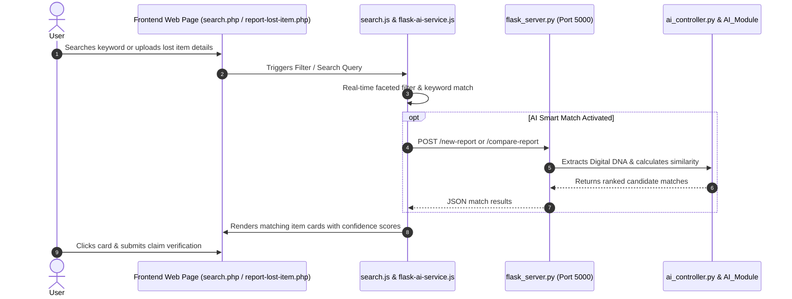

# ⚡ Reunite: AI-Powered Lost & Found Item Matchmaker

**Reunite** is a modern, community-powered Lost & Found web platform integrated with a multimodal **AI Vision & Multimodal Matching Engine**. It automatically processes lost/found item descriptions and photos to extract a standardized **"Digital DNA"** of each item and calculates similarity confidence scores to match lost items with found items.

---

## 🌟 Architecture & Component Overview

The repository is organized into decoupled layers:

```
reunitel/
├── Frontend/                 # PHP / JS / CSS Web Application (Served via XAMPP/Apache)
│   ├── api/
│   │   └── auth.php            # Async auth, profile updates, and password change API
│   ├── components/
│   │   └── nav.php             # Modern dynamic navbar with active indicator, notifications, and avatar badge
│   ├── js/
│   │   ├── profile.js          # Profile dashboard tabs, activity filters & AJAX updates
│   │   ├── search.js           # Live search, faceted filters, AI match & claim modal
│   │   ├── flask-ai-service.js # Dedicated JS Service for Flask REST API communication
│   │   ├── report-lost-item.js # Lost item form handler & AI DNA UI renderer
│   │   ├── report-found-item.js# Found item form handler
│   │   └── home.js             # Community board feeds and filter pills
│   ├── css/
│   │   ├── profile.css         # Profile hero, stats, tab panels & security form styles
│   │   ├── search.css          # Search page styles, filter bars, cards & modals
│   │   ├── variables.css       # Design tokens (colors, typography, spacing) & navbar styles
│   │   └── home.css            # Dashboard styles
│   ├── profile.php           # User Profile Management Dashboard
│   ├── search.php            # Dedicated Search & Discovery interface for lost reporters
│   ├── report-lost-item.php  # Lost item reporting interface
│   ├── report-found-item.php # Found item submission interface
│   └── home.php              # Student dashboard & community board
├── Backend/                  # Core PHP Backend Services & MySQL (lost_connect_db)
│   ├── config/
│   │   └── config.php        # Database configuration, MySQLi connection, and session init
│   ├── functions.php         # Security (AES-256), JSON responses, access logs, & helpers
│   ├── login.php             # Student login handler (supports College PIN, Email, & Phone)
│   ├── registration.php      # Student registration with password hashing and validation
│   ├── logout.php            # Session termination & redirect
│   ├── profile.php           # User profile info, statistics, updates, & password change
│   ├── reports.php           # Direct database persistence for lost_reports & found_reports
│   ├── schema.sql            # Full MySQL database schema dump
│   └── README.md             # Backend architecture & API reference
├── AI_Module/                # Core AI Engine (Analyzers, Prompts, Config, Utilities)
│   ├── analyzers/            # Gemini Vision & Text feature extractors
│   ├── compare/              # Gemini similarity & DNA match evaluation
│   ├── prompts/              # System prompts for Gemini & Mistral LLMs
│   ├── config.py             # Client setup & environment variables loader
│   └── .env                  # API keys storage (Gemini & Mistral)
├── ai_controller.py          # Master AI Controller & Parallel Pipeline Executor
├── flask_server.py           # Master Flask REST API Middleware (Port 5000)
├── matches.py                # Bridge between Flask and AI similarity comparison
├── requirements.txt          # Unified Python dependencies
└── test.http                 # Master API HTTP test suite
```

---

## 🔍 How Each Component Works

### 1. 🌐 Frontend Layer (`Frontend/`)
* **Technology**: PHP, HTML5, Vanilla CSS, JavaScript (ES6+).
* **Role**: Provides interactive user interfaces for registering, logging in, profile management, searching items, reporting lost items, and reporting found items.
* **👤 User Profile Management System (`Frontend/profile.php`, `Frontend/js/profile.js`, `Frontend/css/profile.css`)**:
  * **Hero Identity Card**: Features student avatar initial badge, verified ID tag, institution & branch info, and quick reporting shortcuts.
  * **Activity Metrics Bar**: Displays live counters for filed reports, AI matches, claims verified, and reunited items.
  * **Interactive Tabs**: Tab switching across *Personal Info* (with AJAX live update & header avatar sync), *My Reports* (with Lost/Found filter chips & match alerts), *Security & Password* (with validation), and *Notification Preferences*.
* **🧭 Modern Top Navigation Bar (`Frontend/components/nav.php`)**:
  * **Active Underline Bar**: Solid terracotta bottom bar under current active page links.
  * **Notification Bell**: Bell icon with unread badge dot and instant dropdown preview of match alerts.
  * **Circular Initial Avatar Badge**: Soft peach circle (`#F5DCD0`) displaying user's first name initial, linking to profile.
  * **Adjacent Logout Link**: Clean text button for rapid session sign-out.
  * **Responsive Hamburger Drawer**: Provides full mobile navigation including quick access to profile.
* **Search & Discovery Engine (`Frontend/search.php`, `Frontend/js/search.js`, `Frontend/css/search.css`)**:
  * Provides a dedicated search page for lost item reporters to search across campus found items.
  * Multi-faceted filtering by item status (Found/Lost/Reunited), categories (Electronics, Wallets & Bags, Keys, IDs, Books, Accessories), and campus locations (Library, Cafeteria, Computer Labs, Workshops, Parking).
  * **AI Smart Match**: Live text analysis and confidence ranking against found items based on physical attributes and Digital DNA.
  * **Interactive Item Details & Claim Modal**: Allows students to view complete item specs and submit verification claims for safe handoffs.
* **JS Service Bridge (`Frontend/js/flask-ai-service.js`)**:
  * Acts as a dedicated service layer connecting the web browser directly to the Flask backend.
  * Sends `FormData` requests (`description` + `image` file) via `fetch` to `http://127.0.0.1:5000/new-report`.
  * Contains `renderAiDnaCard()` to dynamically render the extracted AI Digital DNA card into the UI upon successful analysis.
* **📱 Responsive Cross-Device UI**:
  * Fully adaptive mobile, tablet, laptop, and desktop layouts across all pages with touch-optimized controls, auto-scrolling category pill bars, fluid typography (`clamp()`), and adaptive modal dialogs.

### 2. 🗄️ Core PHP Backend & Database Services (`Backend/`)
* **Technology**: PHP 8.x, MySQLi (`lost_connect_db`), OpenSSL AES-256-CBC.
* **Role**: Handles database persistence for student accounts, authentication, profile management, and saving lost/found reports.
* **Key Modules**:
  * **`config/config.php`**: Database connection to `lost_connect_db`, session management, and configuration constants.
  * **`functions.php`**: Security utilities (encryption/decryption), input sanitizers, standardized JSON API responses, and access logging.
  * **`login.php` & `registration.php`**: Student authentication supporting College PIN, Email, and Phone with bcrypt password hashing.
  * **`profile.php`**: Student profile retrieval, profile updates, and password reset endpoints.
  * **`reports.php`**: Direct database insertion and listing for `lost_reports` and `found_reports`.

---

### 3. 🔌 Middleware REST API (`flask_server.py`)
* **Technology**: Python, Flask, Flask-CORS.
* **Role**: Operates as a lightweight HTTP server bridging the PHP frontend to the Python AI engine.
* **Endpoints**:
  * **`GET /`**: Health-check endpoint returning server status.
  * **`POST /new-report`**: Supports both `multipart/form-data` (browser uploads) and `application/json` (API test clients). Receives description & photo, triggers `process_report()`, and returns the generated Digital DNA.
  * **`POST /compare-report`**: Receives a report ID and existing Digital DNAs, triggers `compare_reports()`, and returns ranked match candidates.

---

### 3. 🧠 Master AI Controller (`ai_controller.py`)
* **Role**: Coordinates parallel AI analysis and timing logs.
* **Working**:
  * Receives text description and optional image file path.
  * Spawns a multi-threaded execution pool (`ThreadPoolExecutor`) to run **Text Analysis** and **Image Vision Analysis** concurrently.
  * Passes both raw results to the Digital DNA Generator.

---

### 4. 🔬 AI Intelligence Module (`AI_Module/`)
* **Technology**: **Google Gemini 2.5 Flash** (Vision & NLP) + **Mistral AI** (Synthesis).
* **Sub-components**:
  * **`analyzers/report_analyzer.py`**: Uses Gemini NLP to parse text descriptions into structured attributes (category, brand, color, unique marks).
  * **`analyzers/image_analyzer.py`**: Uses Gemini Multimodal Vision to inspect photo pixels and identify visible features (logos, patterns, damage, camera setups, sub-dials).
  * **`analyzers/digital_dna_generator.py`**: Uses Mistral AI to synthesize text + image attributes into a standardized **Digital DNA** JSON structure.
  * **`compare/compare.py`**: Uses Gemini LLM to compare two Digital DNAs and calculate a 0–100% similarity score based on key attributes and visual evidence.

---

## 🔄 End-to-End Execution Flow



---

## 🛠️ Setup & Running Locally

### 1. Environment Configuration
Ensure your API keys are added in `AI_Module/.env`:
```env
GEMINI_API_KEY=your_gemini_api_key_here
MISTRAL_API_KEY=your_mistral_api_key_here
```

### 2. Install Python Dependencies
```bash
pip install -r requirements.txt
```

### 3. Launch Flask Backend Server
```bash
python flask_server.py
```
*Server runs on:* `http://127.0.0.1:5000`

### 4. Serve the Frontend
Host the `Frontend/` folder using **XAMPP / Apache**:
* **Search Page**: `http://localhost/pw/reunitel/Frontend/search.php`
* **Student Dashboard**: `http://localhost/pw/reunitel/Frontend/home.php`
* **Report Lost Item**: `http://localhost/pw/reunitel/Frontend/report-lost-item.php`
* **Report Found Item**: `http://localhost/pw/reunitel/Frontend/report-found-item.php`

---

## 🧪 Testing the API

You can test backend endpoints directly using the included [`test.http`](file:///c:/xampp/htdocs/pw/reunitel/test.http) file or cURL:

```bash
curl -X POST http://127.0.0.1:5000/new-report \
  -H "Content-Type: application/json" \
  -d '{
    "report_id": "LC-1001",
    "description": "I lost my Vivo Y31 5G smartphone with rose-red back panel.",
    "image_path": "AI_Module/temp_uploads/img1 copy.jpg"
  }'
```
